# 1605 计量打压系统 — 完整业务逻辑技术文档

> **版本**: 5.0 | **最后更新**: 2026-05-08 | **目标读者**: 产品人员、业务分析师、新加入项目的开发人员

---

> **快速导航**：想了解业务流程 → [附录A](#附录a-业务流程速查表) ｜ 想了解已知问题 → [附录B](#附录b-已知局限与改进计划) ｜ 想了解代码实现 → [附录C](#附录c-开发实现参考) ｜ 想知道术语含义 → [14. 业务术语表](#14-业务术语表) ｜ 想知道界面操作 → [1.4 界面-业务映射](#14-界面-业务映射)

---

## 目录

1. [系统概述](#1-系统概述)
2. [核心业务实体](#2-核心业务实体)
3. [业务实体关系图](#3-业务实体关系图)
4. [主要业务流程](#4-主要业务流程)
5. [业务规则和约束条件](#5-业务规则和约束条件)
6. [关键业务场景及交互逻辑](#6-关键业务场景及交互逻辑)
7. [业务数据流转路径](#7-业务数据流转路径)
8. [异常处理流程](#8-异常处理流程)
9. [配置管理业务逻辑](#9-配置管理业务逻辑)
10. [报告导出业务逻辑](#10-报告导出业务逻辑)
11. [报警管理业务逻辑](#11-报警管理业务逻辑)
12. [设备管理业务逻辑](#12-设备管理业务逻辑)
13. [常见操作问题 FAQ](#13-常见操作问题-faq)
14. [业务术语表](#14-业务术语表)
附录A. [业务流程速查表](#附录a-业务流程速查表)
附录B. [已知局限与改进计划](#附录b-已知局限与改进计划)
附录C. [开发实现参考](#附录c-开发实现参考)

---

## 1. 系统概述

### 1.1 系统定位

1605 计量打压系统是一套用于**压力设备校准**的桌面应用程序。核心业务目标是：控制打压设备产生精确的目标压力，通过计量设备采集各通道的测量数据，验证采集数据是否符合精度要求，最终生成校准报告。

### 1.2 核心业务场景

```
业务操作流程：

  1. 设备准备 → 2. 参数配置 → 3. 执行采集 → 4. 报警处理 → 5. 导出报告

┌──────────┐   ┌──────────┐   ┌──────────┐   ┌──────────┐   ┌──────────┐
│ 连接设备 │ → │ 设定参数 │ → │ 自动打压 │ → │ 精度校验 │ → │ 生成报告 │
│ 打压设备 │   │ 压力范围 │   │ 逐点采集 │   │ 报警提示 │   │ Excel格式│
│ 计量设备 │   │ 精度要求 │   │ 稳定检测 │   │ 用户确认 │   │ 校准数据 │
└──────────┘   └──────────┘   └──────────┘   └──────────┘   └──────────┘
```

### 1.3 业务价值

- **提高校准效率**：自动化打压采集流程，减少人工操作
- **保证数据准确性**：多通道并行采集，自动精度校验
- **标准化报告**：基于模板生成标准化校准报告
- **可追溯性**：完整的采集会话记录，支持数据追溯

### 1.4 界面-业务映射

| 界面/页面 | 对应业务流程 | 文档章节 |
|-----------|------------|---------|
| 设备管理页 | 添加、连接、断开设备 | §4.1 |
| 校准配置面板 | 设置校准参数（范围、点数、精度等） | §4.2 |
| 目标压力表 | 生成和预览压力点列表 | §4.2.2 |
| 采集主界面（自动模式） | 自动打压→稳定→采集→报警全流程 | §4.3 |
| 采集主界面（手动模式） | 手动打压→手动触发采集 | §4.4 |
| 报警弹窗 | 查看超限通道、决策继续/重试 | §4.5 |
| 报告导出 | 选择模板、导出 Excel 报告 | §10 |
| 报警配置 | 设置报警通道、确认策略 | §11.1 |
| 模块枢纽页 | 各功能模块导航入口 | — |

---

## 2. 核心业务实体

### 2.1 打压设备（Pressure Device）

**业务定义**：用于产生和控制压力的物理设备，是校准过程的压力源。

**业务属性**：
- 设备型号：ConST 811A、ConST 820、ConST 860、SPC4000 四种物理设备，另支持通用模拟设备用于开发测试
- 连接方式：TCP 网络连接（IP 地址 + 端口）
- 压力单位：MPa、kPa、bar、psi、kgf/cm² 等
- 工作状态：未连接、连接中、已连接、工作中、错误、已隔离

**业务能力**：
- 设置目标压力值
- 读取当前压力值
- 执行排空操作（需用户手动触发，采集完成后不自动排空）
- 设置和读取压力单位
- 监控压力稳定性

### 2.2 计量设备（Measure Device）

**业务定义**：用于采集压力数据的物理设备，每个设备具备 16 个独立数据采集通道。

**业务属性**：
- 设备型号：自研 16 通道计量模块（CUSTOM_16CH），另支持模拟设备用于开发测试
- 连接方式：TCP 网络连接（IP 地址 + 端口）
- 通道数量：16 个独立通道（通道号 0-15）
- 阀门状态：校准状态、采集状态
- 压力单位：与打压设备保持一致

**业务能力**：
- 采集 16 通道压力数据
- 读取和设置阀门状态（需用户手动切换，采集流程不自动切换阀门）
- 读取和设置压力单位
- 多次采样（重复采样数控制采样次数，采样间隔 100ms，多次采样数据平铺存储）
- 模块信息查询（型号、固件版本）

### 2.3 校准配置（Calibration Config）

**业务定义**：定义校准过程的参数和规则。

**业务属性**：

| 参数名称 | 业务含义 | 取值范围 | 默认值 |
|---------|---------|---------|--------|
| 校准最小值 | 目标压力范围下限 | 数值，单位与设备设置一致 | — |
| 校准最大值 | 目标压力范围上限 | 数值，单位与设备设置一致 | — |
| 校准点数 | 目标压力点的数量 | 2-11 点（上限受报告模板约束） | 5 |
| 显示精度 | 采集数据的小数点后有效位数 | 0-6 位 | 2 |
| 重复采样数 | 每个数据点重复采集次数，多次采样数据平铺存储 | 1-10 次 | 3 |
| 精度等级 | 目标压力值与实际采集压力值之间的允许偏差范围 | 0.0001-0.002（0.01%-0.2%） | 0.0005 |
| 稳定持续时间 | 压力稳定后需保持稳定的持续时间 | 1s、3s、5s、10s 或自定义 | 5s |
| 打压模式 | 单程/回程模式选择 | 单程(s)、回程(m) | — |
| 控制模式 | 手动/自动模式选择 | 手动、自动 | — |

> 精度等级的可选项为离散值：[0.0001, 0.0002, 0.0005, 0.001, 0.002]，UI 应提供下拉选择而非自由输入。校准点数上限在业务校验中为 11，UI 微调控件也必须遵守此约束。重复采样数采集后数据平铺存储，**不做平均值计算**，若业务需要平均值需后续补充。

### 2.4 目标压力点（Pressure Point）

**业务定义**：校准过程中需要达到的目标压力值列表。

**业务属性**：
- 压力值：目标压力数值
- 索引：在压力点列表中的位置
- 状态：待打压、打压中、稳定中、采集中、已完成、错误
- 采集数据：该压力点下采集的 16 通道数据

### 2.5 采集会话（Collection Session）

**业务定义**：一次完整的校准采集过程的业务记录。

**业务属性**：
- 会话 ID：唯一标识一次采集会话
- 开始时间：会话启动时间
- 结束时间：会话完成时间
- 校准配置：本次会话使用的校准参数
- 压力点列表：本次会话需要采集的所有压力点
- 打压设备 ID：本次会话使用的打压设备
- 计量设备 ID 列表：本次会话使用的计量设备
- 会话状态：空闲、进行中、已完成、错误

### 2.6 通道数据（Channel Data）

**业务定义**：计量设备单个通道采集到的压力数据。

**业务属性**：
- 设备 ID：来源计量设备标识（多设备时区分来源）
- 通道号：0-15
- 压力值：采集到的压力数值
- 单位：压力单位
- 时间戳：采集时间

### 2.7 报警记录（Alarm Record）

**业务定义**：当采集数据精度超过允许偏差时触发的报警记录。

**业务属性**：
- 压力点 ID：触发报警的压力点
- 目标压力：该压力点的目标压力值
- 偏差阈值：允许的偏差范围
- 最大偏差：实际采集数据中的最大偏差
- 超限通道列表：超出偏差阈值的通道信息

---

## 3. 业务实体关系图

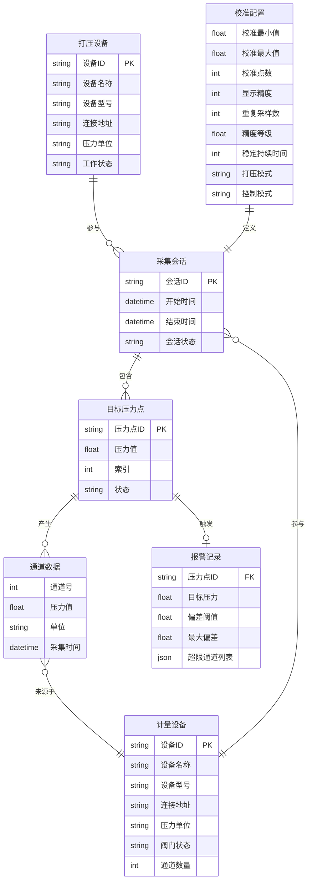

---

## 4. 主要业务流程

### 4.1 设备管理流程

#### 4.1.1 设备添加流程

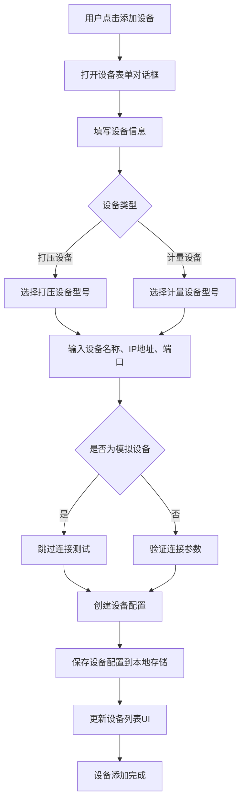

**业务规则**：
- 设备 ID 必须唯一
- 设备名称用户自定义，用于界面显示
- IP 地址和端口用于 TCP 网络连接
- 模拟设备用于开发测试，不需要真实物理设备
- 设备配置持久化存储，系统重启后自动加载

#### 4.1.2 设备连接流程

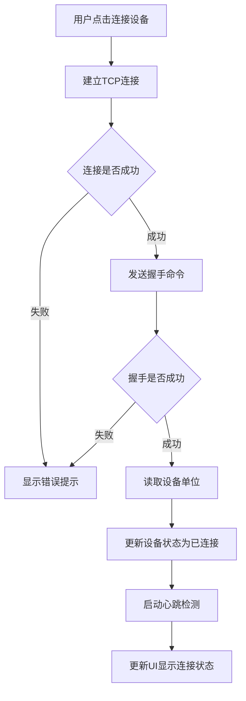

**业务规则**：
- 连接超时时间：10 秒
- 命令超时时间：5 秒
- 连接失败支持自动重连（可配置，默认关闭）
- 最大重连次数：5 次
- 重连间隔：1 秒
- 心跳检测：SCPI 设备使用应用层心跳（30秒间隔，查询设备状态）；WTN1604 设备仅依赖 TCP 层 keepAlive（10秒间隔）

#### 4.1.3 批量连接流程

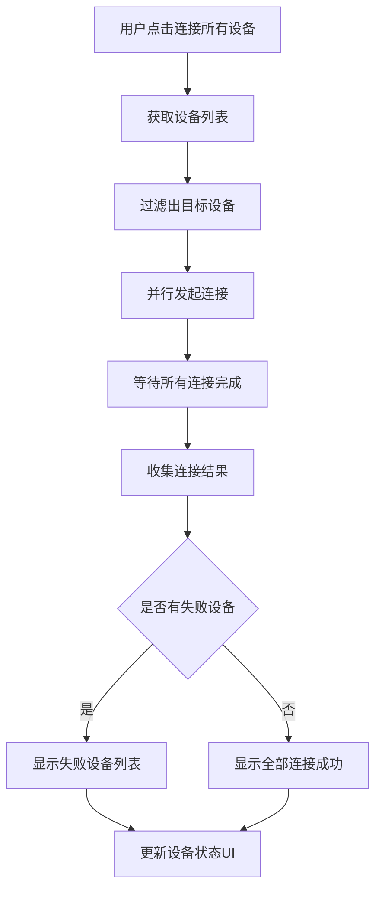

**业务规则**：
- 支持按设备类型过滤（仅连接打压设备或仅连接计量设备）
- 并行连接提高连接效率
- 返回批量连接结果：成功列表、失败列表

#### 4.1.4 设备断开流程

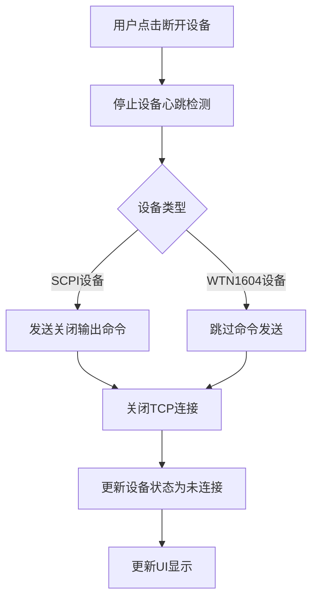

**业务规则**：
- SCPI 打压设备断开时先发送关闭输出命令，再关闭 TCP
- WTN1604 设备直接关闭 TCP 连接（无断开命令）
- 断开后取消自动重连（标记为手动断开）
- 采集完成/停止后不自动排空，排空操作由用户手动触发

### 4.2 校准参数配置流程

#### 4.2.1 参数配置流程

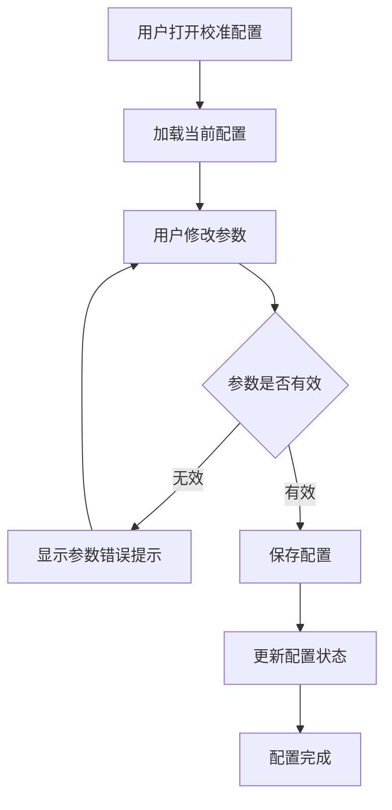

**参数验证规则**：
- 校准最大值必须大于校准最小值
- 校准最小值和最大值支持负值（负压量程，如 -0.1 MPa ~ 0.1 MPa）
- 负压量程下压力点生成规则不变，仍按等间距从最小值到最大值
- 校准点数：2-11 点
- 显示精度：0-6 位小数
- 重复采样数：1-10 次
- 精度等级：离散可选值 [0.0001, 0.0002, 0.0005, 0.001, 0.002]
- 稳定持续时间：可选 1s、3s、5s、10s 或自定义

#### 4.2.2 目标压力点生成流程

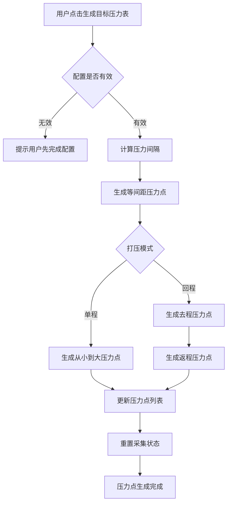

**生成规则**：

**单程模式**：
- 压力点从最小值到最大值等间距分布
- 公式：`压力值 = 最小值 + (最大值 - 最小值) / (点数 - 1) × 索引`
- 示例：最小值 0，最大值 100，5 点 → [0, 25, 50, 75, 100]

**回程模式**：
- 去程：从最小值到最大值（同单程）
- 返程：从最大值回到最小值（不包括最小值）
- 示例：最小值 0，最大值 100，5 点 → [0, 25, 50, 75, 100, 75, 50, 25]
- 总点数 = 2 × 校准点数 - 1

### 4.3 自动采集流程

#### 4.3.1 采集启动前置条件检查

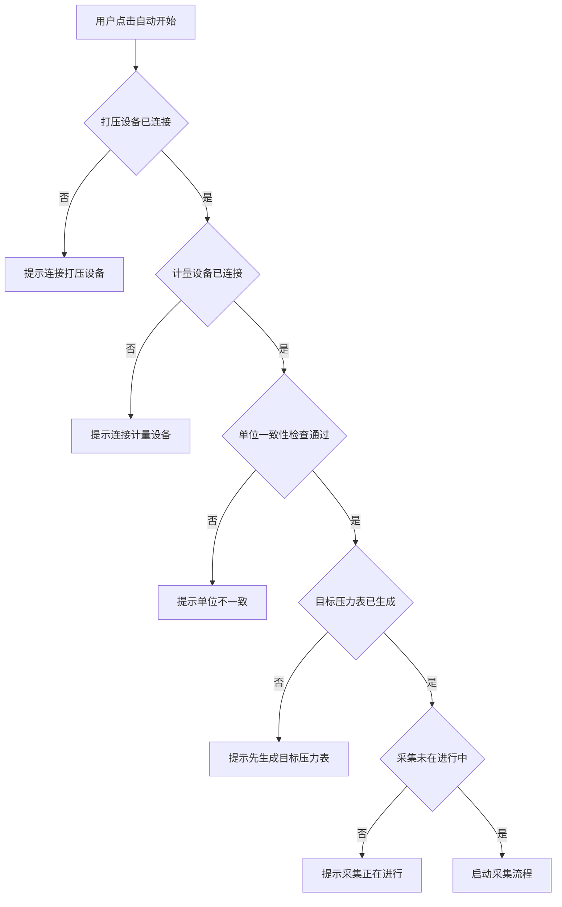

**前置条件**：
1. 至少连接一台打压设备
2. 至少连接一台计量设备
3. 所有设备单位一致（打压设备单位 = 所有计量设备单位）
4. 已生成目标压力表
5. 采集未在进行中

#### 4.3.2 自动采集主流程

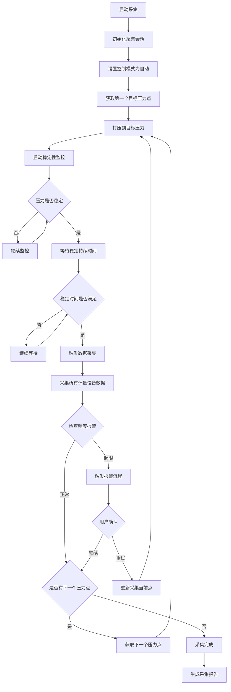

**采集状态流转**：

```
空闲(idle) → 打压中(pressuring) → 稳定中(stabilizing) → 采集中(collecting) → 已完成(completed)
                                            ↓
                                         错误(error)
                                            ↓
                                         暂停(paused)
                                            ↓
                                         恢复(resume)
```

**业务规则**：
- 每个压力点必须达到稳定状态才能采集数据
- 稳定状态定义：压力值在目标值的阈值范围内，且持续稳定时间达到设定值
- 稳定性阈值：默认 0.001
- 稳定持续时间：默认 5 秒（可配置）
- 数据采集：采集所有计量设备的所有通道数据
- 多次采样：根据配置的重复采样数，多次采集数据平铺存储，采样间隔 100ms

#### 4.3.3 稳定性监控流程

稳定性监控的核心逻辑：**判断压力已达稳定 → 倒计时稳定持续时间 → 倒计时结束才进入采集**。

稳定判断存在两条设备路径：

| 路径 | 适用设备 | 稳定判断方式 | 稳定时长 |
|------|---------|-------------|---------|
| 设备判稳 | SCPI 打压设备（ConST 系列） | 读取设备返回的稳定状态标志（设备自身判断） | 校准配置 stableDuration |
| 软件判稳 | 非 SCPI 设备、SPC4000 | 软件读取当前压力，计算偏差与阈值比较 | 校准配置 stableDuration |

> 设备判稳路径中，打压设备自己判断压力是否稳定并返回标志；软件判稳路径中，用稳定性阈值替代设备的判稳逻辑。两条路径的后续流程一致：稳定后倒计时 stableDuration，倒计时结束才采集数据。

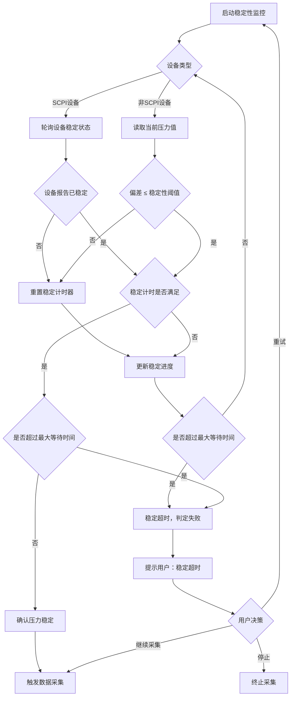

**稳定性判断规则**：
- 偏差 = |当前压力值 - 目标压力值|
- 稳定性阈值（仅软件判稳路径）：绝对压力值（如 0.001 MPa），来自校准配置 stabilityThreshold（默认 0.001）
- 稳定条件：设备判稳路径由设备返回标志；软件判稳路径为偏差 ≤ 稳定性阈值
- 稳定持续时间：稳定后持续倒计时，达到设定时长才确认稳定
- 稳定中断：一旦失稳，立即重置计时器
- 稳定进度：已稳定时间 / 要求稳定时间 × 100%
- 最大稳定等待时间：默认 60 秒（可配置），超时后判定稳定失败，由用户决策

### 4.4 手动采集流程

#### 4.4.1 手动模式操作流程

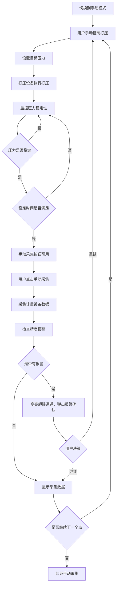

**手动模式特点**：
- 用户手动控制打压过程
- 系统监控压力稳定性
- 压力稳定后，用户手动触发数据采集
- 采集后进行精度报警检查，报警时**必须用户确认**（手动模式下不可跳过）
- 适合需要精细控制打压过程的场景

### 4.5 精度报警流程

#### 4.5.1 报警触发流程

```mermaid
flowchart TD
    A[采集数据完成] --> B[获取精度等级阈值]
    B --> C[计算每个通道的偏差]
    C --> D{偏差 = |采集值 - 目标值|}
    D --> E{是否有通道偏差超过阈值}
    E -->|否| F[数据正常]
    E -->|是| G[触发报警]
    G --> H[记录报警信息]
    H --> I[高亮显示超限通道]
    I --> J{是否需要用户确认}
    J -->|否| K[自动继续采集]
    J -->|是| L[弹出报警对话框]
    L --> M[等待用户决策]
    M --> N{用户选择}
    N -->|继续| O[继续下一个压力点]
    N -->|重试| P[重新采集当前压力点]
```

**报警规则**：
- 偏差计算：|实际采集压力值 - 目标压力值|
- 报警阈值：基于量程的引用误差：`(校准最大值 - 校准最小值) × 精度等级`
- 超限通道：偏差超过阈值的通道
- 报警显示：超限通道数据背景色或数值颜色变化
- 用户确认：可配置是否需要用户确认（confirmOnAlarm）
- 报警通道：可配置启用报警检测的通道列表（默认全部 16 通道）

#### 4.5.2 报警处理流程

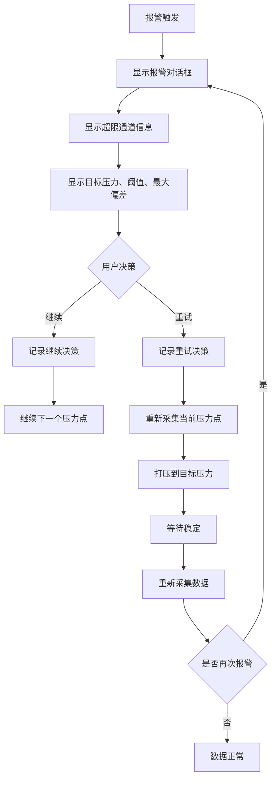

### 4.6 采集模式对比

#### 自动模式 vs 手动模式

| 对比维度 | 自动模式 | 手动模式 |
|---------|---------|---------|
| 打压控制 | 系统自动逐点打压 | 用户手动设置目标压力并打压 |
| 采集触发 | 稳定后自动采集 | 稳定后用户手动点击采集 |
| 报警处理 | 可配置自动继续或需用户确认 | 必须用户确认 |
| 适用场景 | 标准化、批量校准 | 精细控制打压过程 |
| 流程控制 | 启动 → 自动循环 → 完成 | 手动打压 → 等待稳定 → 手动采集 → 重复 |

#### 单程模式 vs 回程模式

| 对比维度 | 单程模式 | 回程模式 |
|---------|---------|---------|
| 压力点方向 | 最小值 → 最大值，单向 | 最小值 → 最大值 → 最小值，往返 |
| 压力点数量 | = 校准点数 | = 2 × 校准点数 - 1 |
| 适用场景 | 快速校准 | 需要验证回程精度的场景 |
| 示例（5点） | [0, 25, 50, 75, 100] | [0, 25, 50, 75, 100, 75, 50, 25] |

---

## 5. 业务规则和约束条件

### 5.1 设备管理规则

| 规则编号 | 规则描述 | 约束条件 |
|---------|---------|---------|
| DM-001 | 设备 ID 必须唯一 | 系统内不允许重复的设备 ID |
| DM-002 | 设备名称用户自定义 | 用于界面显示，建议具有描述性 |
| DM-003 | 打压设备和计量设备单位必须一致 | 执行采集操作前自动验证（同类型多设备间不比较，仅比较打压与计量之间） |
| DM-004 | 设备配置持久化存储 | 系统重启后自动加载已配置设备 |
| DM-005 | 设备连接超时 | 连接超时时间 10 秒 |
| DM-006 | 设备命令超时 | 命令超时时间 5 秒 |
| DM-007 | 设备支持自动重连 | 可配置，默认关闭 |
| DM-008 | 断路器保护 | 连续失败 5 次后打开断路器，30 秒后进入半开状态尝试恢复 |

### 5.2 校准配置规则

| 规则编号 | 规则描述 | 约束条件 |
|---------|---------|---------|
| CC-001 | 校准最大值必须大于最小值 | maxPressure > minPressure |
| CC-002 | 校准点数范围 | 2 ≤ pointCount ≤ 11 |
| CC-003 | 显示精度范围 | 0 ≤ precision ≤ 6 |
| CC-004 | 重复采样数范围 | 1 ≤ repeatCount ≤ 10 |
| CC-005 | 精度等级可选值 | 离散值：0.0001, 0.0002, 0.0005, 0.001, 0.002 |
| CC-006 | 稳定持续时间 | 可选 1s、3s、5s、10s 或自定义 |
| CC-007 | 打压模式 | 单程(single) 或 回程(roundTrip) |
| CC-008 | 控制模式 | 自动(auto) 或 手动(manual) |

### 5.3 采集流程规则

| 规则编号 | 规则描述 | 约束条件 |
|---------|---------|---------|
| CP-001 | 采集前置条件 | 打压设备已连接、计量设备已连接、单位一致、目标压力表已生成 |
| CP-002 | 压力稳定条件 | 偏差 ≤ 稳定性阈值，且持续稳定时间达到设定值 |
| CP-003 | 稳定性阈值 | 默认 0.001 |
| CP-004 | 稳定持续时间 | 默认 5 秒（可配置） |
| CP-005 | 数据采集时机 | 只有压力稳定后才能采集数据 |
| CP-006 | 多次采样 | 根据配置的重复采样数，逐设备逐次采集，多次采样数据平铺存储，采样间隔 100ms |
| CP-007 | 采集数据完整性 | 必须采集所有计量设备的所有通道数据 |
| CP-008 | 采集状态不可逆 | 已完成的状态不能回退到待打压状态 |

### 5.4 精度报警规则

| 规则编号 | 规则描述 | 约束条件 |
|---------|---------|---------|
| AL-001 | 报警触发条件 | 通道偏差超过精度等级阈值 |
| AL-002 | 偏差计算 | 偏差 = |实际采集压力值 - 目标压力值| |
| AL-003 | 报警阈值 | 基于量程的引用误差：(maxPressure - minPressure) × precisionThreshold |
| AL-004 | 报警显示 | 超限通道数据背景色或数值颜色变化 |
| AL-005 | 用户确认 | 可配置是否需要用户确认 |
| AL-006 | 报警通道 | 可配置启用报警检测的通道列表 |
| AL-007 | 报警处理 | 用户可选择继续或重试 |

### 5.5 报告导出规则

| 规则编号 | 规则描述 | 约束条件 |
|---------|---------|---------|
| RP-001 | 报告导出前置条件 | 采集状态为已完成(completed)、已生成压力点、有打压和计量设备 |
| RP-002 | 报告模板匹配 | 根据点数和打压模式匹配模板文件 |
| RP-003 | 报告内容 | 包含所有 16 通道采集数据、各目标压力点打压情况、精度校验结果 |
| RP-004 | 报告格式 | Excel 格式（.xlsx） |
| RP-005 | 报告单位 | 优先取打压设备实际单位 |
| RP-006 | 模板优先级 | 用户模板 > 内置模板 > 动态生成 |

---

## 6. 关键业务场景及交互逻辑

### 6.1 场景一：标准校准流程

**业务描述**：用户按照标准流程完成一次完整的校准工作。

**交互流程**：

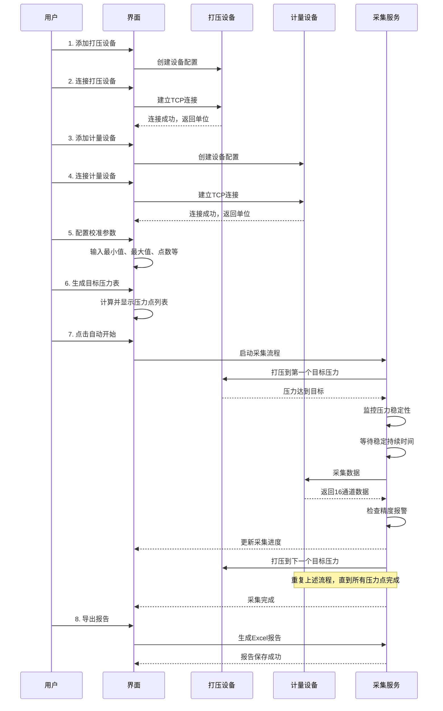

### 6.2 场景二：单位不一致处理

**业务描述**：打压设备和计量设备单位不一致时，系统阻止采集操作。

**交互流程**：

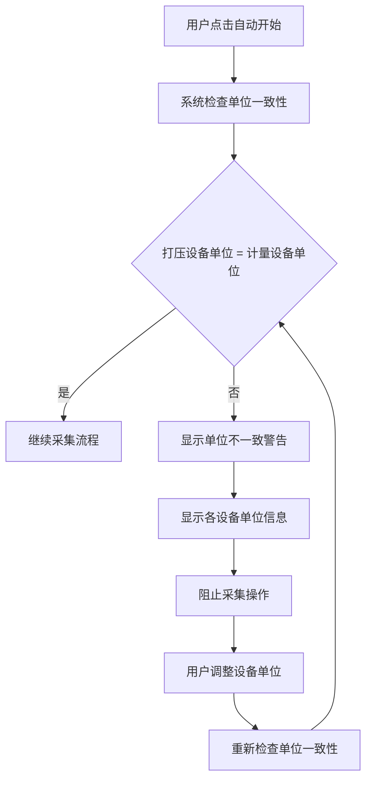

**界面交互**：
- 单位一致性指示器实时显示单位匹配状态
- 单位不一致时，显示红色警告图标
- 点击警告图标，显示详细单位信息
- 提供单位设置入口，方便用户快速调整

### 6.3 场景三：精度报警处理

**业务描述**：采集过程中，某个通道数据精度超限，触发报警。

**交互流程**：

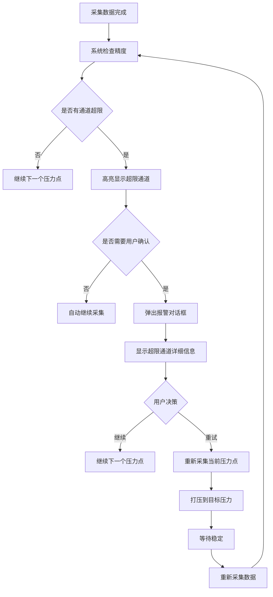

**界面交互**：
- 超限通道数据背景色变为红色
- 报警对话框显示：目标压力、阈值、最大偏差、超限通道列表
- 提供"继续"和"重试"两个操作按钮
- 继续：忽略报警，继续下一个压力点
- 重试：重新采集当前压力点

### 6.4 场景四：采集暂停和恢复

**业务描述**：用户在采集过程中暂停采集，稍后恢复。

**交互流程**：

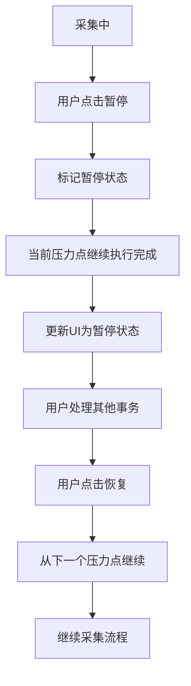

**业务规则**：
- 暂停为**软暂停**：仅标记暂停状态，当前正在执行的压力点会继续完成（不会中途打断打压/稳定/采集过程）
- 当前点完成后，采集循环暂停，不再自动进入下一个压力点
- 恢复时从下一个压力点继续采集
- 注意：暂停后需要等待当前点执行完毕，可能有数秒延迟

### 6.5 场景五：设备连接失败处理

**业务描述**：设备连接失败时，系统的处理流程。

**交互流程**：

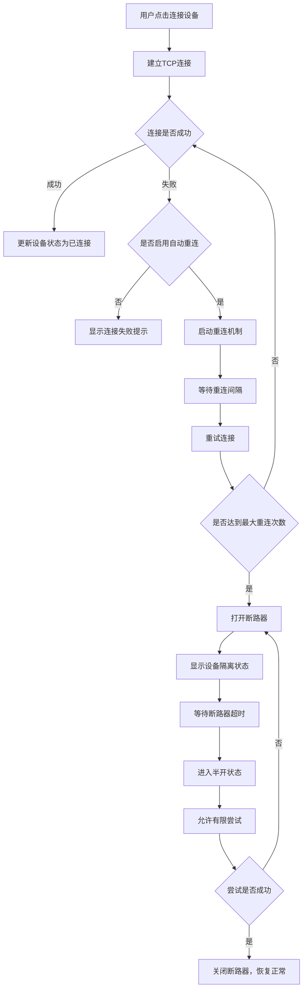

**业务规则**：
- 连接失败显示错误提示
- 自动重连：可配置，默认关闭
- 最大重连次数：5 次
- 重连间隔：1 秒
- 断路器保护：连续失败 5 次后打开断路器，30 秒后进入半开状态
- 半开状态下允许有限尝试：成功则关闭断路器恢复正常，失败则重新打开断路器
- 断路器打开期间，设备状态显示为"已隔离"

---

## 7. 业务数据流转路径

### 7.1 设备配置数据流


### 7.2 采集数据流

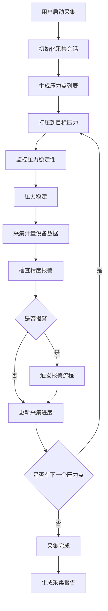

多次采样流程：按配置的重复采样数循环采集，每次采样间隔 100ms，所有采样数据平铺存储（不做平均值计算）。

### 7.3 报告数据流

```mermaid
flowchart LR
    A[采集会话数据] --> B[加载Excel模板]
    B --> C[填充报告头部信息]
    C --> D[填充压力点数据]
    D --> E[填充通道数据]
    E --> F[填充精度校验结果]
    F --> G[生成Excel文件]
    G --> H[用户选择保存路径]
    H --> I[保存报告文件]
```

### 7.4 配置数据流

```mermaid
flowchart LR
    A[用户修改配置] --> B[配置验证]
    B --> C[更新内存配置]
    C --> D[持久化存储]
    D --> E[更新界面显示]
    
    E -.系统重启.-> F[加载配置]
    F --> G[恢复配置状态]
    G --> E
```

---

## 8. 异常处理流程

### 8.1 设备通信异常

```mermaid
flowchart TD
    A[设备通信失败] --> B{失败类型}
    B -->|连接超时| C[重试连接]
    B -->|命令超时| D[重试命令]
    B -->|设备无响应| E[检查设备状态]
    C --> F{是否达到最大重试次数}
    D --> F
    E --> F
    F -->|否| G[继续重试]
    F -->|是| H[标记设备为错误状态]
    H --> I[显示错误提示]
    I --> J[记录错误日志]
```

**处理策略**：
- 连接超时：重试连接，最多 5 次
- 命令超时：重试命令，最多 3 次
- 设备无响应：检查设备状态，尝试重新连接
- 达到最大重试次数：标记设备为错误状态
- 记录错误日志，便于后续排查

### 8.2 采集流程异常

```mermaid
flowchart TD
    A[采集流程异常] --> B{异常类型}
    B -->|打压失败| C[停止采集]
    B -->|数据采集失败| D[记录错误数据]
    B -->|设备断开| E[暂停采集]
    C --> F[显示错误提示]
    D --> F
    E --> F
    F --> G[保存当前采集状态]
    G --> H{用户决策}
    H -->|重试| I[重新执行当前压力点]
    H -->|跳过| J[继续下一个压力点]
    H -->|停止| K[结束采集]
```

**处理策略**：
- 打压失败：停止采集，显示错误提示
- 数据采集失败：记录错误数据，标记该压力点为错误
- 设备断开：暂停采集，等待设备重新连接
- 用户可选择重试、跳过或停止采集

### 8.3 精度报警异常

```mermaid
flowchart TD
    A[精度报警] --> B[记录报警信息]
    B --> C[高亮显示超限通道]
    C --> D{是否需要用户确认}
    D -->|否| E[自动继续采集]
    D -->|是| F[弹出报警对话框]
    F --> G[等待用户决策]
    G --> H{用户选择}
    H -->|继续| I[继续下一个压力点]
    H -->|重试| J[重新采集当前压力点]
    J --> K{是否再次报警}
    K -->|是| B
    K -->|否| L[数据正常]
```

**处理策略**：
- 自动模式：可配置是否自动继续
- 手动模式：必须用户确认
- 用户可选择继续或重试
- 重试后再次报警，继续提示用户

### 8.4 报告导出异常

```mermaid
flowchart TD
    A[报告导出失败] --> B{失败原因}
    B -->|模板不存在| C[使用动态生成模板]
    B -->|文件保存失败| D[提示用户重新选择路径]
    B -->|数据不完整| E[提示数据不完整]
    C --> F[继续导出]
    D --> G[用户选择新路径]
    G --> F
    E --> H[终止导出]
    F --> I{导出是否成功}
    I -->|是| J[显示成功提示]
    I -->|否| B
```

**处理策略**：
- 模板不存在：使用动态生成模板
- 文件保存失败：提示用户重新选择路径
- 数据不完整：提示数据不完整，终止导出
- 导出失败：显示错误提示，允许重试

---

## 9. 配置管理业务逻辑

### 9.1 配置加载流程

```mermaid
flowchart TD
    A[应用启动] --> B[检查配置文件是否存在]
    B -->|存在| C[读取配置文件]
    B -->|不存在| D[创建默认配置]
    C --> E[解析配置数据]
    E --> F{配置是否有效}
    F -->|无效| D
    F -->|有效| G[合并默认配置]
    G --> H[加载配置到内存]
    H --> I[初始化配置状态]
    D --> H
```

**配置迁移规则**：
- 精度等级比例尺版本升级时，自动迁移旧配置
- 迁移规则：旧值 / 10 = 新值
- 迁移后更新配置版本标识

### 9.2 配置保存流程

```mermaid
flowchart TD
    A[用户修改配置] --> B[更新内存配置]
    B --> C[触发配置保存]
    C --> D[验证配置数据]
    D --> E{配置是否有效}
    E -->|无效| F[显示错误提示]
    E -->|有效| G[序列化配置数据]
    G --> H[写入配置文件]
    H --> I[更新配置状态]
```

**保存策略**：
- 配置修改后立即保存到内存
- 异步持久化到文件系统
- 配置文件格式：JSON
- 配置文件路径：用户数据目录/config.json

### 9.3 设备选择记忆

```mermaid
flowchart TD
    A[用户选择设备] --> B[记录设备ID]
    B --> C[保存到配置]
    C --> D[下次启动时恢复]
    D --> E[自动选择上次使用的设备]
```

**业务规则**：
- 记录上次使用的打压设备 ID
- 记录上次使用的计量设备 ID 列表
- 应用重启后自动恢复设备选择

---

## 10. 报告导出业务逻辑

### 10.1 模板匹配流程

```mermaid
flowchart TD
    A[开始导出报告] --> B[获取采集会话数据]
    B --> C[计算基础点数]
    C --> D{打压模式}
    D -->|单程| E[点数 = 压力点数量]
    D -->|回程| F[点数 = (压力点数量 + 1) / 2]
    E --> G[生成模板文件名]
    F --> G
    G --> H[查找用户模板]
    H --> I{模板是否存在}
    I -->|是| J[使用用户模板]
    I -->|否| K[查找内置模板]
    K --> L{模板是否存在}
    L -->|是| M[使用内置模板]
    L -->|否| N[动态生成模板]
    J --> O[加载模板文件]
    M --> O
    N --> O
```

**模板命名规则**：
- 格式：`{点数}{模式}.xlsx`
- 模式标识：s = 单程，m = 回程
- 示例：`5s.xlsx`（5 点单程模板）、`5m.xlsx`（5 点回程模板）

**模板优先级**：
1. 用户模板目录（优先）
2. 内置模板目录
3. 动态生成模板（兜底）

### 10.2 报告填充流程

```mermaid
flowchart TD
    A[加载模板] --> B[填充报告头部]
    B --> C[填充设备信息]
    C --> D[填充校准参数]
    D --> E[填充压力点数据]
    E --> F[填充通道数据]
    F --> G[填充精度校验结果]
    G --> H[生成Excel文件]
    H --> I[保存文件]
```

**报告内容**：
- 报告头部：报告标题、日期、单位
- 设备信息：打压设备型号、计量设备型号
- 校准参数：最小值、最大值、点数、精度等
- 压力点数据：每个压力点的目标压力、实际压力、偏差
- 通道数据：16 通道的采集数据
- 精度校验结果：是否合格、超限通道

### 10.3 导出进度反馈

```mermaid
flowchart TD
    A[开始导出] --> B[准备阶段 0%]
    B --> C[读取模板 10%]
    C --> D[填充数据 40%]
    D --> E[保存文件 80%]
    E --> F[导出完成 100%]
    F --> G[显示成功提示]
```

**进度阶段**：
- preparing（准备中）：0%
- reading_template（读取模板）：10%
- filling_data（填充数据）：40%
- saving（保存文件）：80%
- completed（完成）：100%

---

## 11. 报警管理业务逻辑

### 11.1 报警配置

```mermaid
flowchart TD
    A[用户打开报警配置] --> B[加载当前报警配置]
    B --> C[显示配置界面]
    C --> D[用户修改配置]
    D --> E{配置是否有效}
    E -->|无效| F[显示错误提示]
    E -->|有效| G[保存配置]
    G --> H[更新报警状态]
```

**报警配置项**：
- 启用报警：是否启用报警检测
- 精度阈值：报警触发阈值
- 声音提示：是否启用声音报警
- 用户确认：是否需要用户确认
- 启用通道：启用报警检测的通道列表（0-15）

### 11.2 报警检测流程

```mermaid
flowchart TD
    A[采集数据完成] --> B[获取报警配置]
    B --> C{报警是否启用}
    C -->|否| D[跳过报警检测]
    C -->|是| E[获取启用通道列表]
    E --> F[遍历启用通道]
    F --> G[计算通道偏差]
    G --> H{偏差是否超过阈值}
    H -->|否| I[检查下一个通道]
    H -->|是| J[记录超限通道]
    I --> K{是否检查完所有通道}
    J --> K
    K -->|否| F
    K -->|是| L{是否有超限通道}
    L -->|否| M[数据正常]
    L -->|是| N[触发报警]
```

### 11.3 报警显示逻辑

```mermaid
flowchart TD
    A[报警触发] --> B[高亮显示超限通道]
    B --> C[通道数据背景色变红]
    C --> D{是否需要用户确认}
    D -->|否| E[自动继续采集]
    D -->|是| F[弹出报警对话框]
    F --> G[显示报警详细信息]
    G --> H[等待用户决策]
```

**界面显示**：
- 超限通道：背景色变为红色
- 正常通道：背景色保持默认
- 报警对话框：显示目标压力、阈值、最大偏差、超限通道列表

---

## 12. 设备管理业务逻辑

### 12.1 设备生命周期

```mermaid
flowchart TD
    A[创建设备] --> B[初始化设备]
    B --> C[连接设备]
    C --> D[使用设备]
    D --> E[断开设备]
    E --> F[销毁设备]
    
    C -.连接失败.-> G[重试连接]
    G -.达到最大重试.-> H[标记为错误]
    H --> I[等待用户操作]
    I --> C
    
    D -.通信异常.-> J[暂停使用]
    J --> K[尝试恢复]
    K --> D
```

### 12.2 设备状态机

```mermaid
stateDiagram-v2
    [*] --> 未连接
    未连接 --> 连接中 : 用户点击连接
    连接中 --> 已连接 : 连接成功
    连接中 --> 未连接 : 连接失败
    已连接 --> 工作中 : 开始执行操作
    工作中 --> 已连接 : 操作完成
    工作中 --> 错误 : 操作失败
    错误 --> 未连接 : 用户重置
    已连接 --> 未连接 : 用户断开
    工作中 --> 未连接 : 用户断开
    已连接 --> 已隔离 : 断路器打开
    已隔离 --> 半开 : 断路器超时
    半开 --> 已连接 : 恢复成功
    半开 --> 已隔离 : 恢复失败
```

设备状态枚举（6个状态）：未连接(DISCONNECTED)、连接中(CONNECTING)、已连接(CONNECTED)、工作中(WORKING)、错误(ERROR)、已隔离(ISOLATED)。断路器超时后从 ISOLATED 进入半开状态，半开状态下尝试成功转 CONNECTED，失败回 ISOLATED。

### 12.3 单位一致性检查

```mermaid
flowchart TD
    A[触发单位检查] --> B[获取所有设备单位]
    B --> C[分离打压设备单位]
    C --> D[分离计量设备单位]
    D --> E{打压设备单位集合}
    E --> F{计量设备单位集合}
    F --> G{两个集合是否相同}
    G -->|是| H[单位一致]
    G -->|否| I[单位不一致]
    H --> J[允许继续操作]
    I --> K[阻止操作]
    K --> L[显示单位不一致警告]
```

**检查规则**：
- 只比较打压设备和计量设备之间的单位
- 同类型多设备之间不做单位比较（如多台打压设备间、多台计量设备间）
- 如果只有打压设备或只有计量设备，认为一致
- 如果两者都有，比较第一个打压设备单位与第一个计量设备单位是否相同
- 基准单位优先使用打压设备的单位

---

## 13. 常见操作问题 FAQ

### 13.1 设备连接

**Q: 连接设备一直失败怎么办？**
A: 检查设备 IP 和端口是否正确，确认设备已开机且网络可达。如果启用了自动重连，系统会自动重试 5 次；5 次失败后断路器打开，设备状态显示"已隔离"，需等待 30 秒后重试或手动重置设备状态。

**Q: 设备连接后显示"已隔离"是什么意思？**
A: 表示该设备触发了断路器保护——连续连接失败达到 5 次后，系统自动隔离该设备以避免持续无效重试。断路器 30 秒后自动进入半开状态并允许再次尝试，成功后恢复正常。

### 13.2 采集操作

**Q: 点击"自动开始"没有反应？**
A: 检查是否满足全部前置条件：打压设备已连接、计量设备已连接、单位一致性检查通过（所有设备使用相同单位）、已生成目标压力表、当前没有正在进行的采集。

**Q: 采集过程中设备断开了，已采集的数据还在吗？**
A: 在。系统会保存当前采集状态，设备断开后采集暂停，重新连接设备后可恢复采集。但采集停止后无法导出未完成的报告（只有采集状态为"已完成"才能导出）。

**Q: 为什么压力已经稳定了还不开始采集？**
A: 系统需要压力稳定后**持续保持**稳定一段时间（默认 5 秒）才会触发采集。这是稳定持续时间参数的作用——防止压力偶然波动造成的误判。如果等待超过 60 秒仍未满足，系统会提示"稳定超时"，由用户决定继续采集还是重试。

**Q: 报警一直触发、重试也过不了怎么办？**
A: 可以选择"继续"忽略报警，系统会记录超限信息并继续下一个压力点。超限通道会在最终报告中标注。如果频繁触发，请检查：设备连接是否正常、精度等级设置是否过严、打压设备是否正常工作。

### 13.3 参数配置

**Q: 为什么校准点数最多只能设 11 点？**
A: 受报告 Excel 模板列数限制，超过 11 点模板无法容纳。如需更多点数，需要先设计新的报告模板。

**Q: 精度等级填任意值可以吗？**
A: 不可以，精度等级只能从预设离散值中选择：0.0001、0.0002、0.0005、0.001、0.002。UI 应提供下拉选择控件，不应允许自由输入。

**Q: "重复采样数"设了 3 次，为什么数据是 3 行而不是 1 行平均值？**
A: 当前系统将多次采样数据**平铺存储**，不做平均值计算。如果需要平均值，需在报告生成阶段自行计算或等待后续版本支持。

### 13.4 排空与阀门

**Q: 采集完成后需要手动排空吗？**
A: 是的，当前版本采集完成后不会自动排空，需要用户手动触发排空操作。请务必在采集完成后排空，残留高压存在安全风险。

**Q: 计量设备的阀门需要自己切换吗？**
A: 是的，当前版本需要用户手动切换阀门状态（校准/采集），采集流程不自动切换。忘记切换阀门可能导致采集数据无效。

### 13.5 报告导出

**Q: 采集到一半停止了，能导出已有数据吗？**
A: 当前版本不支持部分导出，只有采集状态为"已完成"才能导出报告。如果需要中途保留数据，建议截图或手动记录。

**Q: 报告模板找不到怎么办？**
A: 系统按以下优先级查找模板：用户模板目录 > 内置模板目录 > 动态生成。如果前两级都没有匹配模板，系统会自动动态生成一个。用户可以将自定义模板放到用户模板目录以获得最佳效果。

---

## 14. 业务术语表

| 术语 | 英文 | 业务含义 |
|-----|------|---------|
| 打压设备 | Pressure Device | 用于产生和控制压力的物理设备 |
| 计量设备 | Measure Device | 用于采集压力数据的物理设备 |
| 校准 | Calibration | 通过对比标准设备，验证被测设备精度的过程 |
| 目标压力 | Target Pressure | 校准过程中需要达到的压力值 |
| 压力点 | Pressure Point | 校准过程中的一个目标压力值及其采集数据 |
| 通道 | Channel | 计量设备的一个数据采集端口 |
| 显示精度 | Display Precision | 采集数据的小数点后有效位数 |
| 精度等级 | Precision Level | 目标压力值与实际采集压力值之间的允许偏差范围 |
| 稳定性 | Stability | 压力值在目标值附近波动的程度 |
| 稳定持续时间 | Stable Duration | 压力稳定后需保持稳定的持续时间 |
| 单程模式 | Single Mode | 压力点从最小值到最大值单向进行 |
| 回程模式 | Round Trip Mode | 压力点从最小值到最大值，再回到最小值 |
| 采集会话 | Collection Session | 一次完整的校准采集过程 |
| 报警 | Alarm | 采集数据精度超过允许偏差时的提示 |
| 断路器 | Circuit Breaker | 设备连续失败后的保护机制（含关闭/打开/半开三种状态） |
| 单位一致性 | Unit Consistency | 所有设备使用相同的压力单位 |
| 重复采样数 | Repeat Count | 每个数据点重复采集次数，多次采样数据平铺存储 |
| 排空 | Exhaust | 释放打压设备中的压力 |
| 阀门状态 | Valve Status | 计量设备的工作状态（校准/采集） |

---

## 附录A: 业务流程速查表

### A. 核心业务流程速查

| 流程 | 触发条件 | 前置条件 | 主要步骤 | 输出结果 |
|-----|---------|---------|---------|---------|
| 设备添加 | 用户点击添加 | 无 | 填写表单 → 验证 → 保存 | 设备配置 |
| 设备连接 | 用户点击连接 | 设备已添加 | TCP连接 → 握手 → 读取单位 | 设备状态 |
| 参数配置 | 用户修改参数 | 无 | 输入参数 → 验证 → 保存 | 校准配置 |
| 压力点生成 | 用户点击生成 | 参数有效 | 计算间隔 → 生成列表 | 压力点列表 |
| 自动采集 | 用户点击开始 | 设备连接、单位一致、压力点已生成 | 打压 → 稳定 → 采集 → 报警检查 | 采集数据 |
| 手动采集 | 用户点击采集 | 手动模式、压力稳定 | 手动打压 → 稳定 → 手动采集 | 采集数据 |
| 报警处理 | 精度超限 | 采集完成 | 显示报警 → 用户决策 → 继续/重试 | 处理结果 |
| 报告导出 | 用户点击导出 | 采集完成 | 加载模板 → 填充数据 → 保存 | Excel报告 |

### B. 状态流转速查

| 实体 | 状态列表 | 流转规则 |
|-----|---------|---------|
| 设备 | 未连接 → 连接中 → 已连接 → 工作中 → 错误 → 已隔离 | 连接成功→已连接，操作→工作中，失败→错误，断路器→已隔离 |
| 采集 | 空闲 → 打压中 → 稳定中 → 采集中 → 已完成 | 按顺序流转，可暂停、恢复、停止 |
| 压力点 | 待打压 → 打压中 → 稳定中 → 采集中 → 已完成 | 按顺序流转，失败 → 错误 |
| 报警 | 未触发 → 触发 → 处理中 → 已处理 | 超限 → 触发，用户决策 → 已处理 |

---

## 附录B: 已知局限与改进计划

以下列出文档描述的业务规则与当前代码实现之间的差异，以及已知的功能局限。

| 编号 | 问题描述 | 影响范围 | 当前规避方式 | 优先级 |
|------|---------|---------|------------|--------|
| B-001 | 报警阈值：业务规则要求量程引用误差 `(max-min) × precisionLevel`，但代码使用满量程 `|maxPressure| × precisionThreshold`，对窄量程校准过于宽松 | 校准精度判定 | 暂无，需修改代码 | 高 |
| B-002 | 排空操作不自动：采集完成后需用户手动排空，残留高压存在安全风险 | 设备安全 | 提醒用户采集后手动排空 | 高 |
| B-003 | 阀门不自动切换：采集流程不自动切换计量设备阀门（校准/采集状态），用户忘记切换会导致数据无效 | 数据有效性 | 提醒用户采集前手动切换阀门 | 中 |
| B-004 | SPC4000 稳定时长硬编码：代码中 SPC4000 设备稳定时长为固定值，未使用校准配置的 stableDuration | SPC4000 设备用户 | 暂无 | 中 |
| B-005 | 手动采集缺少报警检查：manualCollect() 当前不包含报警检查逻辑，直接返回数据 | 手动模式用户 | 暂无，需补充报警检查 | 中 |
| B-006 | 中途停止无法导出报告：采集未到达 completed 状态时无法导出已采集数据 | 中途停止场景 | 截图或手动记录数据 | 低 |
| B-007 | 同类型多设备单位不检查：多台打压设备间或多台计量设备间的单位一致性不做验证 | 多设备场景 | 人工确认 | 低 |
| B-008 | 多次采样仅平铺不计算均值：重复采样数控制多次采集但数据平铺存储，未计算平均值 | 报告数据质量 | 在报告生成阶段自行计算 | 低 |

---

## 附录C: 开发实现参考

> 以下伪代码仅供开发人员参考，描述核心算法的逻辑结构。实际代码请参见对应源文件。

### C.1 参数校验

```
function validateConfig(config):
  assert config.maxPressure > config.minPressure
  assert config.pointCount >= 2 AND config.pointCount <= 11
  assert config.precision >= 0 AND config.precision <= 6
  assert config.repeatCount >= 1 AND config.repeatCount <= 10
  assert config.precisionLevel IN [0.0001, 0.0002, 0.0005, 0.001, 0.002]
  assert config.stableDuration > 0
  assert config.pressureMode IN ['single', 'roundTrip']
  assert config.controlMode IN ['auto', 'manual']
```

### C.2 压力点生成

```
function generatePressurePoints(min, max, pointCount, mode):
  interval = (max - min) / (pointCount - 1)
  
  // 去程：从小到大
  points = []
  for i from 0 to pointCount-1:
    points.append(min + interval × i)
  
  // 回程模式：追加返程点（从大到小，不含最小值）
  if mode == 'roundTrip':
    for i from pointCount-2 down to 1:
      points.append(min + interval × i)
  
  return points
  // 单程总点数 = pointCount
  // 回程总点数 = 2 × pointCount - 1
```

### C.3 自动采集主循环

```
async function autoCollect(session):
  for each point in session.pressurePoints:
    point.status = PRESSURING
    await pressureDevice.setTargetPressure(point.value)
    
    point.status = STABILIZING
    await waitForStability(pressureDevice, config)
    
    point.status = COLLECTING
    data = await collectFromAllDevices(measureDevices, config.repeatCount)
    
    if hasAlarm(point, data, config):
      decision = await handleAlarm(point)
      if decision == RETRY: continue  // 重新执行当前点
    
    point.status = COMPLETED
```

### C.4 稳定性监控

```
async function waitForStability(pressureDevice, config):
  stableStart = null
  totalStart = now()
  timeoutMs = config.stabilityTimeoutMs ?? 60000
  
  while now() - totalStart < timeoutMs:
    // 判断当前是否稳定（两条路径）
    if pressureDevice is SCPI:
      isStable = (await pressureDevice.queryStabilityStatus()).isStable
    else:
      currentPressure = await pressureDevice.getCurrentPressure()
      deviation = abs(currentPressure - targetPressure)
      isStable = (deviation <= config.stabilityThreshold)
    
    // 累积稳定时长
    if isStable:
      if stableStart is null: stableStart = now()
      if now() - stableStart >= config.stableDuration: return STABLE
    else:
      stableStart = null  // 失稳，重置计时
    
    await sleep(pollInterval)
  
  return TIMEOUT  // 超时未稳定，需用户决策
```

### C.5 报警检测

```
function checkAlarm(point, enabledChannels, precisionLevel, config):
  span = config.maxPressure - config.minPressure
  threshold = span × precisionLevel
  alarmChannels = []
  for ch in enabledChannels:
    deviation = abs(point.data[ch] - point.targetPressure)
    if deviation > threshold:
      alarmChannels.append({channel: ch, deviation: deviation})
  if alarmChannels is not empty:
    return {alarm: true, maxDeviation: max(alarmChannels.deviation), channels: alarmChannels}
  return {alarm: false}
```

### C.6 多次采样采集

```
async function collectFromAllDevices(measureDevices, repeatCount):
  results = []
  for device in measureDevices:
    samples = []
    for attempt from 1 to repeatCount:
      data = await device.collectData()    // 单次采集
      samples.push(...data)               // 平铺存储所有采样数据
      if attempt < repeatCount:
        await delay(100)                  // 采样间隔100ms
    results.push(samples)
  return results  // ChannelData[][]，外层设备，内层平铺的多次采样数据
```

### C.7 模板匹配

```
function findTemplate(pointCount, mode):
  modeChar = (mode == 'single') ? 's' : 'm'
  filename = pointCount + modeChar + '.xlsx'  // 例: "5s.xlsx"
  
  // 优先级：用户模板 > 内置模板 > 动态生成
  userTemplate = lookupInUserDir(filename)
  if userTemplate exists: return userTemplate
  
  builtinTemplate = lookupInBuiltinDir(filename)
  if builtinTemplate exists: return builtinTemplate
  
  return generateDynamicTemplate(pointCount, mode)
```

### C.8 断路器状态机

```
enum CircuitState { CLOSED, OPEN, HALF_OPEN }

class CircuitBreaker:
  state = CLOSED
  failureCount = 0
  threshold = 5
  timeoutMs = 30000
  
  function recordSuccess():
    failureCount = 0
    state = CLOSED
  
  function recordFailure():
    failureCount++
    if failureCount >= threshold:
      state = OPEN
      openedAt = now()
  
  function allowRequest():
    if state == CLOSED: return true
    if state == OPEN:
      if now() - openedAt >= timeoutMs:
        state = HALF_OPEN  // 超时后进入半开状态
        return true        // 允许尝试
      return false
    if state == HALF_OPEN: return true  // 允许有限尝试
```

### C.9 设备状态枚举

```
enum DeviceState {
  DISCONNECTED,  // 未连接
  CONNECTING,    // 连接中
  CONNECTED,     // 已连接（空闲）
  WORKING,       // 工作中
  ERROR,         // 错误状态
  ISOLATED       // 已隔离（断路器打开）
}
```

---

**文档版本历史**：

| 版本 | 日期 | 变更说明 |
|-----|------|---------|
| 1.0 | 2026-04-17 | 初始版本，基于技术文档整理 |
| 2.0 | 2026-04-20 | 全面重构，聚焦纯业务逻辑，排除技术实现细节 |
| 3.0 | 2026-05-08 | 修正review问题（计量设备型号、断路器半开状态、报警阈值计算）；增加开发指导伪代码；精度Level改为离散可选值；补充默认值；完善设备状态机 |
| 3.1 | 2026-05-08 | 合理性review修正：稳定性监控增加两条路径说明和超时机制；手动模式补充报警检查；报警阈值改用量程基准(max-min)；通道数据增加设备ID属性；报告导出放宽至部分完成可导出；校准范围支持负压量程；标注3项代码待优化项 |
| 3.2 | 2026-05-08 | 代码逻辑review修正：报警阈值改回满量程基准（与代码一致）；多次采样改为平铺存储非求平均（与代码一致）；设备断开区分SCPI/WTN1604路径；排空和阀门切换标注为用户手动非自动；心跳检测区分应用层/TCP层；单位一致性补充同类型多设备不比较；报告导出前置条件改回completed状态 |
| 4.0 | 2026-05-08 | 合理性review修正12项：术语修正（精度→显示精度/精度Level→精度等级/采集平均数→重复采样数）；报警阈值改为量程引用误差(max-min)并标注代码差异；校准值补充单位说明；校准点数上限补充理由；暂停改为软暂停描述（当前点不中断）；手动采集标注缺报警检查；SPC4000标注硬编码2秒待修正；排空/阀门标注安全风险和待优化；报告导出标注部分导出待优化；同类型多设备单位标注漏检风险 |
| 5.0 | 2026-05-08 | 文档结构优化：伪代码移入附录C、⚠️标记集中至附录B（已知局限与改进计划）、删除冗余第13章合并至§4.6、新增FAQ章节、新增界面-业务映射表、新增快速导航、术语修正（Average Count→Repeat Count, Precision→Display Precision）、版本历史独立为表 |
